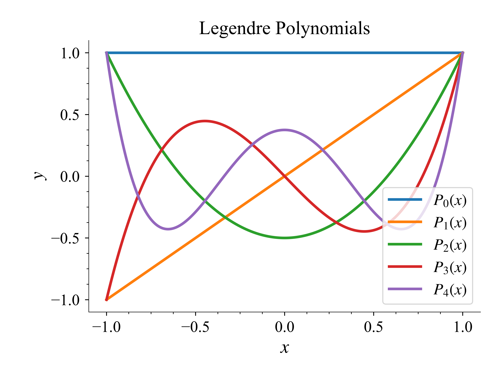

# ScientificPlot

<center></center>

This repository is for anyone wants to format a nice figure in scientific jounal or paper.

# Getting Started

1. Clone this repository to get started with your own scientific plotting journey:
   ```bash
   git clone https://github.com/Physics-Morris/ScientificPlot.git
2. See the example in 'example_plot.ipynb'

# Future Update
Future improvemnt are coming, also welcome any contribution :)
